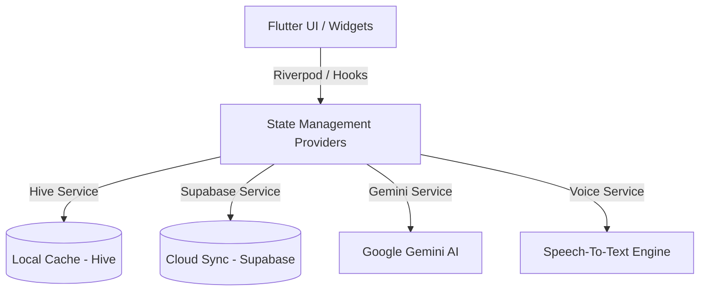

# 🎓 Temari (ተማሪ)
### *The Ultimate AI Study Companion for Ethiopian Students*

**Temari** (ተማሪ — meaning *"student"* in Amharic) is an ultra-premium, offline-first AI study companion application engineered specifically to bridge the digital divide for university and high school students in Ethiopia. By combining high-performance local caching with advanced generative AI orchestration, Temari provides state-of-the-art educational assistance that remains fully functional without an active internet connection.

---

## 🎨 Design Philosophy & Aesthetic System

Temari is crafted to feel like a premium, tactile physical workbook. The user interface prioritizes long-duration focus, visual harmony, and interactive excellence:

*   **Warm Parchment Palette:** The background utilizes a curated warm parchment hue (`0xFFF8F5EF`) that mimics clean, high-grade reading paper to significantly reduce eye strain compared to harsh white screens.
*   **Rich Espresso Accents:** Styled with a deeply rich espresso/coffee brown primary color system (`0xFF5D4037`), soft cocoa bg tints (`0xFFEFEBE9`), and warm amber-brown glows (`0xFF8D6E63`).
*   **Holographic Audio Waveforms:** The recording module draws a stunning **dual-layered vertically painted equalizer** with linear gradients that animate dynamically to voice inputs.
*   **High-Contrast Typography:** Uses bold, geometric headers paired with highly readable body typefaces for optimal cognitive absorption.
*   **Micro-Animations:** Fluid, spring-loaded buttons and elastic cards respond to user touch, making the interface feel alive.

---

## 🚀 Key Functionalities

### 1. 🤖 Unified AI Chat Tutor (`TutorChatScreen`)
An expert tutor that is deeply knowledgeable in the Ethiopian university curriculum. 
*   **Voice Dictation:** Fully integrated speech-to-text dictation allows students to speak their questions. The input composer glows red and pulses dynamically while streaming live transcriptions.
*   **Threaded Study Sessions:** Organize study chats into distinct topics. You can quickly start a new session directly from the header bar or review your previous threads in the session drawer.
*   **Adaptive Fallback Auth:** A seamless authentication panel that registers new users automatically on their first sign-in attempt, routing them directly to their study dashboard.

### 2. 📂 Multimodal Study Notes (`NoteScreen`)
Group study resources into visual subjects. Capture your materials in four highly customizable formats:
*   **Voice Notes:** Dictate lectures on the fly. Review the live speech-to-text output in a fully editable TextField, make quick edits, and send the final text to the AI for instantaneous breakdowns.
*   **Photo Scans (OCR):** Snap blackboard equations or textbook screenshots to extract and summarize their text.
*   **PDF Imports:** Upload files, lecture slides, and books.
*   **Text Summaries:** Type structured summaries and key bullet points manually.

### 3. 🧠 Smart AI Study Tools
*   **Spaced Repetition Flashcards:** With a single tap, the AI synthesizes all combined notes in a subject into interactive review cards with flip animations.
*   **Exam Paper Predictor:** Instantly generates predicted exam question papers based on the student's actual notes, complete with detailed breakdowns of high-priority assessment topics.
*   **Focus Timer:** An elegant Pomodoro timer to enforce structured focus intervals.

### 4. 📴 Offline-First Sync Architecture
*   **Ultra-Fast Local Cache:** Powered by schema-less **Hive** database boxes, allowing the app to open instantly, save notes, review flashcards, and run timers entirely offline.
*   **Supabase Cloud Sync:** When internet connectivity is detected, Temari automatically pushes local changes and pulls cloud backups, keeping state perfectly synchronized across all the student's devices.

---

## 🏗️ Technical Architecture & Stack



### Stack Breakdown:
*   **Framework:** Flutter (Dart) — High-performance multi-platform UI.
*   **State Management:** `flutter_riverpod` + `hooks_riverpod` + `flutter_hooks` for reactive state cycles.
*   **Local Storage:** `hive` for offline schema-less databases.
*   **Cloud Backend:** `supabase_flutter` for relational sync and auth.
*   **AI Engine:** `google_generative_ai` (configured with `gemini-1.5-flash` or `gemini-2.5` targets).
*   **Audio/Voice:** `speech_to_text` for real-time localized dictations.

---

## 📁 Directory Structure

```bash
lib/
├── app.dart                  # Main router, themes, and GoRouter redirection logic
├── main.dart                 # Initialization bootstrap (Hive, Supabase, AppEnv)
├── core/
│   ├── config/               # App environment configuration (.env loader)
│   ├── constants/            # Global UI values (AppColors, AppTextStyles, AppStrings)
│   ├── providers/            # Riverpod bootstrap configurations
│   └── services/             # Platform adapters (Gemini, Hive, Supabase, Voice)
├── features/
│   ├── auth/                 # Sign-in sheets, user sessions, onboarding screens
│   ├── chat/                 # AI tutor chat box, multi-session logic
│   ├── flashcards/           # Flip card widgets and reviews
│   ├── home/                 # Dynamic grid dashboards
│   ├── notes/                # Note creator (text, voice, photo, file) and details
│   ├── settings/             # Language preferences and profile adjustments
│   ├── subjects/             # Subject detail screens and aggregates
│   └── timer/                # Pomodoro study focus clock
└── shared/
    ├── models/               # Data model definitions (Subject, Note, Flashcard)
    └── widgets/              # Reusable premium components (Buttons, loaders)
```

---

## ⚙️ Development & Environment Setup

### Prerequisites
*   Flutter SDK (3.22.0+ recommended)
*   Dart SDK (3.4.0+)
*   Supabase CLI (optional, for DB migrations)

### 1. Configure Keys
Create a `.env` file in the root directory:
```env
GEMINI_API_KEY=your_gemini_key_here
SUPABASE_URL=your_supabase_project_url
SUPABASE_ANON_KEY=your_supabase_anon_key
```

### 2. Install Packages & Run
Fetch dependencies and run the application:
```sh
flutter pub get
flutter run
```

> [!IMPORTANT]
> Because `.env` is bundled into the asset pipeline in `pubspec.yaml`, adding or changing values in your `.env` requires a **full compilation restart** (`flutter run`) rather than a standard hot reload.

---

**Temari** is built with passion to empower the next generation of Ethiopian students. 🚀
